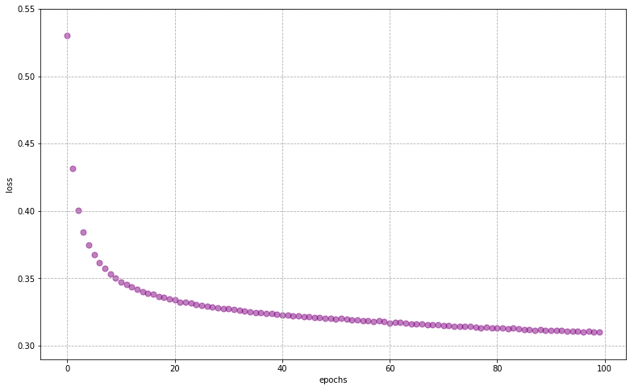
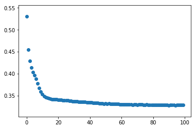
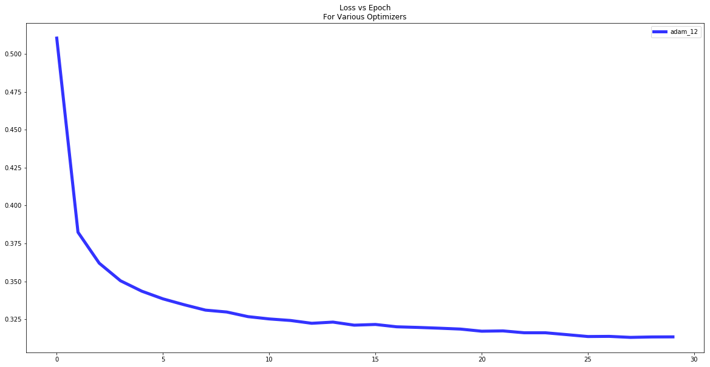
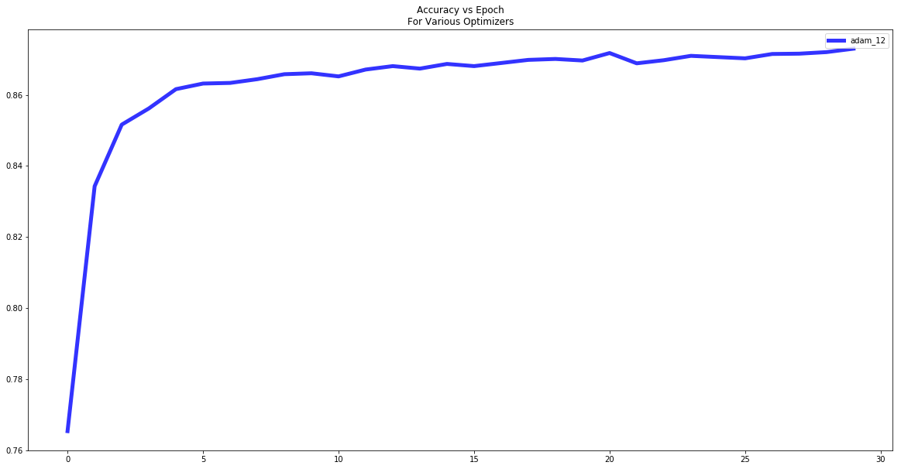

Most of this code can be found at <a href='https://keras.io'>keras.io</a>

### Questions
- How do we organize our workflow for NN
    - Is there a graphic that displays this?
- Train/Test/Validation hold out


### Objectives
YWBAT
- optimize NNs by tuning hyperparameters
- explain various parameters of our NN hyperparameters
    - i.e. tuning 'meta-parameters'

# Useful Inputs


```python
import keras
import numpy as np
import pandas as pd

import matplotlib.pyplot as plt
```


```python
from keras import models
from keras import layers
from keras import optimizers
```

# Obtaining Dataset & Train-Test Split

Nothing different from training other models


```python
from sklearn.datasets import load_iris
from sklearn.model_selection import train_test_split
from sklearn.preprocessing import OneHotEncoder, StandardScaler

iris = load_iris()
x = iris['data']
y = iris['target']
names = iris['target_names']
feature_names = iris['feature_names']

# One hot encoding
enc = OneHotEncoder()
y = enc.fit_transform(y[:, np.newaxis]).toarray()

# Scale data to have mean 0 and variance 1 
# which is importance for convergence of the neural network
scaler = StandardScaler()
x_scaled = scaler.fit_transform(x)

# Split the data set into training and testing
x_train, x_test, y_train, y_test = train_test_split(x_scaled, y, test_size=0.4, random_state=2)
```

    /anaconda3/lib/python3.7/site-packages/sklearn/preprocessing/_encoders.py:415: FutureWarning: The handling of integer data will change in version 0.22. Currently, the categories are determined based on the range [0, max(values)], while in the future they will be determined based on the unique values.
    If you want the future behaviour and silence this warning, you can specify "categories='auto'".
    In case you used a LabelEncoder before this OneHotEncoder to convert the categories to integers, then you can now use the OneHotEncoder directly.
      warnings.warn(msg, FutureWarning)


```python
df = pd.read_csv("MagicTelescope.csv")
df.drop("ID", axis=1, inplace=True)
df.head(2)
```


<div>
<style scoped>
    .dataframe tbody tr th:only-of-type {
        vertical-align: middle;
    }

    .dataframe tbody tr th {
        vertical-align: top;
    }

    .dataframe thead th {
        text-align: right;
    }
</style>
<table border="1" class="dataframe">
  <thead>
    <tr style="text-align: right;">
      <th></th>
      <th>fLength:</th>
      <th>fWidth:</th>
      <th>fSize:</th>
      <th>fConc:</th>
      <th>fConc1:</th>
      <th>fAsym:</th>
      <th>fM3Long:</th>
      <th>fM3Trans:</th>
      <th>fAlpha:</th>
      <th>fDist:</th>
      <th>class:</th>
    </tr>
  </thead>
  <tbody>
    <tr>
      <th>0</th>
      <td>28.7967</td>
      <td>16.0021</td>
      <td>2.6449</td>
      <td>0.3918</td>
      <td>0.1982</td>
      <td>27.7004</td>
      <td>22.0110</td>
      <td>-8.2027</td>
      <td>40.0920</td>
      <td>81.8828</td>
      <td>g</td>
    </tr>
    <tr>
      <th>1</th>
      <td>31.6036</td>
      <td>11.7235</td>
      <td>2.5185</td>
      <td>0.5303</td>
      <td>0.3773</td>
      <td>26.2722</td>
      <td>23.8238</td>
      <td>-9.9574</td>
      <td>6.3609</td>
      <td>205.2610</td>
      <td>g</td>
    </tr>
  </tbody>
</table>
</div>


```python
X = df.drop("class:", axis=1)
y = df["class:"]
```


```python
enc = OneHotEncoder()
```


```python
y = enc.fit_transform(y[:, np.newaxis]).toarray()
y[:3]
```


    array([[1., 0.],
           [1., 0.],
           [1., 0.]])


```python
# Scale data to have mean 0 and variance 1 
# which is importance for convergence of the neural network
scaler = StandardScaler()
x_scaled = scaler.fit_transform(X)

# Split the data set into training and testing
x_train, x_test, y_train, y_test = train_test_split(x_scaled, y, test_size=0.4, random_state=2)
```


```python
x_train.shape, y_train.shape
```


    ((11412, 10), (11412, 2))


# Creating a Neural Network

`Sequential` is referring to the neural networks we've observed. There are other neural network models that will go beyond this class.


```python
from keras.models import Sequential

model = Sequential()
```

The actual network; we can decide how many layers & nodes for each layer here as well as other hyperparameters like the activation function.


```python
from keras.layers import Dense

model.add(Dense(units=16, activation='relu', input_dim=10))
model.add(Dense(units=2, activation='softmax'))
```

Compile the model to a form that the computer can more easily work with


```python
model.compile(loss=keras.losses.categorical_crossentropy, 
              optimizer=optimizers.SGD(lr=0.001, momentum=0.9, nesterov=True))
```


```python
model.summary()
```

    _________________________________________________________________
    Layer (type)                 Output Shape              Param #   
    =================================================================
    dense_17 (Dense)             (None, 16)                176       
    _________________________________________________________________
    dense_18 (Dense)             (None, 2)                 34        
    =================================================================
    Total params: 210
    Trainable params: 210
    Non-trainable params: 0
    _________________________________________________________________


# Using the Model

Using the model structure, we do sequences of feedfoward and then backpropagation to adjust the weights and biases (training/fitting)


```python
history = model.fit(x_train, y_train, epochs=100, batch_size=16, verbose=1)
```

    WARNING:tensorflow:From /anaconda3/lib/python3.7/site-packages/tensorflow/python/ops/math_ops.py:3066: to_int32 (from tensorflow.python.ops.math_ops) is deprecated and will be removed in a future version.
    Instructions for updating:
    Use tf.cast instead.
    Epoch 1/100
    11412/11412 [==============================] - 1s 129us/step - loss: 0.5301
    Epoch 2/100
    11412/11412 [==============================] - 1s 78us/step - loss: 0.4314: 0s - loss
    Epoch 3/100
    11412/11412 [==============================] - 1s 70us/step - loss: 0.4006
    Epoch 4/100
    11412/11412 [==============================] - 1s 72us/step - loss: 0.3845
    Epoch 5/100
    11412/11412 [==============================] - 1s 67us/step - loss: 0.3746
    Epoch 6/100
    11412/11412 [==============================] - 1s 83us/step - loss: 0.3675
    Epoch 7/100
    11412/11412 [==============================] - 1s 90us/step - loss: 0.3618: 0
    Epoch 8/100
    11412/11412 [==============================] - 1s 87us/step - loss: 0.3572: 0s - loss - ETA: 0s - loss: 0.
    Epoch 9/100
    11412/11412 [==============================] - 1s 88us/step - loss: 0.3531
    Epoch 10/100
    11412/11412 [==============================] - 1s 105us/step - loss: 0.3501 0s - loss: 0.3
    Epoch 11/100
    11412/11412 [==============================] - 1s 94us/step - loss: 0.3474: 0
    Epoch 12/100
    11412/11412 [==============================] - 1s 83us/step - loss: 0.3452
    Epoch 13/100
    11412/11412 [==============================] - 1s 86us/step - loss: 0.3434: 0s - loss
    Epoch 14/100
    11412/11412 [==============================] - 1s 89us/step - loss: 0.3417: 0s
    Epoch 15/100
    11412/11412 [==============================] - 1s 104us/step - loss: 0.3401 0s - lo
    Epoch 16/100
    11412/11412 [==============================] - 1s 104us/step - loss: 0.3387 0s - 
    Epoch 17/100
    11412/11412 [==============================] - 1s 95us/step - loss: 0.3381
    Epoch 18/100
    11412/11412 [==============================] - 1s 95us/step - loss: 0.3367: 0s - loss: 0.337
    Epoch 19/100
    11412/11412 [==============================] - 1s 90us/step - loss: 0.3358: 0
    Epoch 20/100
    11412/11412 [==============================] - 1s 88us/step - loss: 0.3348: 0s - loss: 0.337 - ETA: 0s 
    Epoch 21/100
    11412/11412 [==============================] - 1s 91us/step - loss: 0.3340: 0s - loss: 0.3
    Epoch 22/100
    11412/11412 [==============================] - 1s 88us/step - loss: 0.3325: 0s - loss: 0.339 - ETA: 0s - lo - ETA: 0s - loss: 0.
    Epoch 23/100
    11412/11412 [==============================] - 1s 102us/step - loss: 0.3324 0s - loss: 0.3
    Epoch 24/100
    11412/11412 [==============================] - 1s 95us/step - loss: 0.3316
    Epoch 25/100
    11412/11412 [==============================] - 1s 89us/step - loss: 0.3307: 0s - 
    Epoch 26/100
    11412/11412 [==============================] - 1s 94us/step - loss: 0.3300
    Epoch 27/100
    11412/11412 [==============================] - 1s 85us/step - loss: 0.3294
    Epoch 28/100
    11412/11412 [==============================] - 1s 82us/step - loss: 0.3289
    Epoch 29/100
    11412/11412 [==============================] - 1s 93us/step - loss: 0.3282: 0s - loss: 0
    Epoch 30/100
    11412/11412 [==============================] - 1s 82us/step - loss: 0.3278
    Epoch 31/100
    11412/11412 [==============================] - 1s 85us/step - loss: 0.3274
    Epoch 32/100
    11412/11412 [==============================] - 1s 95us/step - loss: 0.3268: 0s - loss: 0 - ETA: 0s - loss
    Epoch 33/100
    11412/11412 [==============================] - 1s 79us/step - loss: 0.3264
    Epoch 34/100
    11412/11412 [==============================] - 1s 81us/step - loss: 0.3257
    Epoch 35/100
    11412/11412 [==============================] - 1s 82us/step - loss: 0.3253
    Epoch 36/100
    11412/11412 [==============================] - 1s 85us/step - loss: 0.3246: 0s - l
    Epoch 37/100
    11412/11412 [==============================] - 1s 87us/step - loss: 0.3243
    Epoch 38/100
    11412/11412 [==============================] - 1s 87us/step - loss: 0.3242
    Epoch 39/100
    11412/11412 [==============================] - 1s 89us/step - loss: 0.3237: 0s - lo
    Epoch 40/100
    11412/11412 [==============================] - 1s 88us/step - loss: 0.3234: 
    Epoch 41/100
    11412/11412 [==============================] - 1s 89us/step - loss: 0.3226: 0s - loss: 0.322
    Epoch 42/100
    11412/11412 [==============================] - 1s 87us/step - loss: 0.3225: 0s - loss: 0.32
    Epoch 43/100
    11412/11412 [==============================] - 1s 87us/step - loss: 0.3220: 0s - loss: 0.31
    Epoch 44/100
    11412/11412 [==============================] - 1s 83us/step - loss: 0.3223: 0s - lo
    Epoch 45/100
    11412/11412 [==============================] - 1s 82us/step - loss: 0.3216
    Epoch 46/100
    11412/11412 [==============================] - 1s 82us/step - loss: 0.3215
    Epoch 47/100
    11412/11412 [==============================] - 1s 91us/step - loss: 0.3207: 0s - loss: 0.3
    Epoch 48/100
    11412/11412 [==============================] - 1s 97us/step - loss: 0.3208
    Epoch 49/100
    11412/11412 [==============================] - 1s 94us/step - loss: 0.3203
    Epoch 50/100
    11412/11412 [==============================] - 1s 94us/step - loss: 0.3205: 0s - loss: 0.3
    Epoch 51/100
    11412/11412 [==============================] - 2s 132us/step - loss: 0.3199
    Epoch 52/100
    11412/11412 [==============================] - 1s 118us/step - loss: 0.3203
    Epoch 53/100
    11412/11412 [==============================] - 1s 103us/step - loss: 0.3194
    Epoch 54/100
    11412/11412 [==============================] - 1s 99us/step - loss: 0.3192: 0s - loss: 0.
    Epoch 55/100
    11412/11412 [==============================] - 1s 106us/step - loss: 0.3191 0s - loss: 0.3 - ETA: 0s - loss:
    Epoch 56/100
    11412/11412 [==============================] - 1s 86us/step - loss: 0.3187
    Epoch 57/100
    11412/11412 [==============================] - 1s 86us/step - loss: 0.3183
    Epoch 58/100
    11412/11412 [==============================] - 1s 88us/step - loss: 0.3181: 0s - loss: 0 - ETA: 0s - lo
    Epoch 59/100
    11412/11412 [==============================] - 1s 89us/step - loss: 0.3184: 0s - loss: 0.32
    Epoch 60/100
    11412/11412 [==============================] - 1s 100us/step - loss: 0.3176
    Epoch 61/100
    11412/11412 [==============================] - 1s 76us/step - loss: 0.3170: 0s - loss
    Epoch 62/100
    11412/11412 [==============================] - 1s 84us/step - loss: 0.3174: 0s - loss: 0.314
    Epoch 63/100
    11412/11412 [==============================] - 1s 78us/step - loss: 0.3171
    Epoch 64/100
    11412/11412 [==============================] - 1s 82us/step - loss: 0.3168
    Epoch 65/100
    11412/11412 [==============================] - 1s 76us/step - loss: 0.3163: 0s - l
    Epoch 66/100
    11412/11412 [==============================] - 1s 71us/step - loss: 0.3159
    Epoch 67/100
    11412/11412 [==============================] - 1s 79us/step - loss: 0.3159: 0s - loss: - ETA: 0s - loss: 0.31
    Epoch 68/100
    11412/11412 [==============================] - 1s 77us/step - loss: 0.3153: 0s - 
    Epoch 69/100
    11412/11412 [==============================] - 1s 69us/step - loss: 0.3154: 0s - loss: 0.3
    Epoch 70/100
    11412/11412 [==============================] - 1s 91us/step - loss: 0.3156: 0s - loss: - ETA: 0s - loss: 
    Epoch 71/100
    11412/11412 [==============================] - 1s 77us/step - loss: 0.3150: 0s - loss:  - ETA: 0s - loss: 0.
    Epoch 72/100
    11412/11412 [==============================] - 1s 74us/step - loss: 0.3148
    Epoch 73/100
    11412/11412 [==============================] - 1s 81us/step - loss: 0.3144
    Epoch 74/100
    11412/11412 [==============================] - 1s 79us/step - loss: 0.3144: 0s - loss: 0.31
    Epoch 75/100
    11412/11412 [==============================] - 1s 86us/step - loss: 0.3141
    Epoch 76/100
    11412/11412 [==============================] - 1s 84us/step - loss: 0.3145: 0s - loss: 
    Epoch 77/100
    11412/11412 [==============================] - 1s 81us/step - loss: 0.3137
    Epoch 78/100
    11412/11412 [==============================] - 1s 78us/step - loss: 0.3134
    Epoch 79/100
    11412/11412 [==============================] - 1s 85us/step - loss: 0.3135
    Epoch 80/100
    11412/11412 [==============================] - 1s 82us/step - loss: 0.3133
    Epoch 81/100
    11412/11412 [==============================] - 1s 70us/step - loss: 0.3130: 0s - lo
    Epoch 82/100
    11412/11412 [==============================] - 1s 80us/step - loss: 0.3132: 0s - loss: 0.3 - ETA: 0s - loss: 0.30 - ETA: 0s - loss: 0.3 - ETA: 0s - loss: 0
    Epoch 83/100
    11412/11412 [==============================] - 1s 92us/step - loss: 0.3126
    Epoch 84/100
    11412/11412 [==============================] - 1s 84us/step - loss: 0.3131
    Epoch 85/100
    11412/11412 [==============================] - 1s 83us/step - loss: 0.3125: 0s - loss: 0.313 - ETA: 0s - loss: 0.
    Epoch 86/100
    11412/11412 [==============================] - 1s 73us/step - loss: 0.3118
    Epoch 87/100
    11412/11412 [==============================] - 1s 68us/step - loss: 0.3117
    Epoch 88/100
    11412/11412 [==============================] - 1s 84us/step - loss: 0.3114
    Epoch 89/100
    11412/11412 [==============================] - 1s 90us/step - loss: 0.3117: 0s - lo
    Epoch 90/100
    11412/11412 [==============================] - 1s 93us/step - loss: 0.3114: 0s 
    Epoch 91/100
    11412/11412 [==============================] - 1s 87us/step - loss: 0.3111
    Epoch 92/100
    11412/11412 [==============================] - 1s 89us/step - loss: 0.3110
    Epoch 93/100
    11412/11412 [==============================] - 1s 88us/step - loss: 0.3112
    Epoch 94/100
    11412/11412 [==============================] - 1s 90us/step - loss: 0.3108
    Epoch 95/100
    11412/11412 [==============================] - 1s 90us/step - loss: 0.3108
    Epoch 96/100
    11412/11412 [==============================] - 1s 84us/step - loss: 0.3110: 0s - loss:
    Epoch 97/100
    11412/11412 [==============================] - 1s 89us/step - loss: 0.3103: 0s -  - ETA: 0s - loss: 0.310
    Epoch 98/100
    11412/11412 [==============================] - 1s 82us/step - loss: 0.3106
    Epoch 99/100
    11412/11412 [==============================] - 1s 90us/step - loss: 0.3099: 0s - loss: 0.30 - ETA: 0s -
    Epoch 100/100
    11412/11412 [==============================] - 1s 88us/step - loss: 0.3099: 0s - loss: 0.30


```python
def plot_history(history, figsize=(13, 8), color='purple', s=50, alpha=0.5):
    plt.figure(figsize=figsize)
    plt.grid(zorder=0, linestyle='--')
    plt.scatter(history.epoch, history.history["loss"], c=color, s=s, alpha=alpha)
    plt.xlabel("epochs")
    plt.ylabel("loss")
    plt.show()
    
    
plot_history(history)
```





```python
### Let's build a new model and add another layer
model_mlp = Sequential()

model_mlp.add(Dense(input_dim=10, units=4, activation='relu'))
model_mlp.add(Dense(units=16, activation='relu'))
model_mlp.add(Dense(units=2, activation='softmax'))

# Relu is used to solve the vanishing gradient that is introduced by sigmoid functions
# Leaky Relu allows weights with negative parameters to update slowly


# Last layer classifiers usually use 'softmax' if ydim > 1 or 'sigmoid' if ydim == 1

model_mlp.summary()
```

    _________________________________________________________________
    Layer (type)                 Output Shape              Param #   
    =================================================================
    dense_27 (Dense)             (None, 4)                 44        
    _________________________________________________________________
    dense_28 (Dense)             (None, 16)                80        
    _________________________________________________________________
    dense_29 (Dense)             (None, 2)                 34        
    =================================================================
    Total params: 158
    Trainable params: 158
    Non-trainable params: 0
    _________________________________________________________________


```python
model_mlp.compile(loss=keras.losses.categorical_crossentropy, 
              optimizer=optimizers.SGD(lr=0.001, momentum=0.9, nesterov=True))

history = model_mlp.fit(x_train, y_train, epochs=100, batch_size=16, verbose=0)
plt.scatter(history.epoch, history.history["loss"])
```


    <matplotlib.collections.PathCollection at 0x1a31f29b00>





### Let's try and tune our optimizer


```python
optimizer_dict = {"adam_12": {"optimizer": optimizers.Adam(lr=0.01, epsilon=0.2, amsgrad=True), "color": "blue"}}
#                  "adam_01": {"optimizer": optimizers.Adam(lr=0.01), "color": "orange"}}
#                   "sgd_nag": {"optimizer": optimizers.SGD(lr=0.01, momentum=0.9, nesterov=True), "color": "pink"},
#                   "sgd": {"optimizer": optimizers.SGD(lr=0.01), "color": "red"},
#                   "adagrad": {"optimizer": optimizers.Adagrad(), "color": "yellow"},
#                   "adadelta": {"optimizer": optimizers.Adadelta(), "color": "teal"}}


```


```python
for label, optimizer in optimizer_dict.items():
    # Build Model
    model = Sequential()
    model.add(Dense(units=10, activation='relu', input_dim=10))
    model.add(Dense(units=2, activation='softmax'))
    
    # compile model
    model.compile(loss=keras.losses.categorical_crossentropy, optimizer=optimizer['optimizer'], metrics=['accuracy'])
    
    # train our model and get our history
    history = model.fit(x_train, y_train, epochs=30, batch_size=16, verbose=1)
    
    # store history to our dictionary
    optimizer_dict[label]['history'] = history
    print(f"Finished fitting {label} optimizer")
```

    Epoch 1/30
    11412/11412 [==============================] - 3s 279us/step - loss: 0.5104 - acc: 0.7653 0s - loss: 0.5167 - acc: 0.76
    Epoch 2/30
    11412/11412 [==============================] - 2s 143us/step - loss: 0.3824 - acc: 0.8343
    Epoch 3/30
    11412/11412 [==============================] - 2s 136us/step - loss: 0.3620 - acc: 0.8516
    Epoch 4/30
    11412/11412 [==============================] - 2s 147us/step - loss: 0.3504 - acc: 0.8562 0s - loss: 0.3469 - a
    Epoch 5/30
    11412/11412 [==============================] - 2s 146us/step - loss: 0.3436 - acc: 0.8616
    Epoch 6/30
    11412/11412 [==============================] - 2s 139us/step - loss: 0.3385 - acc: 0.8632
    Epoch 7/30
    11412/11412 [==============================] - 2s 144us/step - loss: 0.3346 - acc: 0.8634
    Epoch 8/30
    11412/11412 [==============================] - 2s 142us/step - loss: 0.3311 - acc: 0.8644 0s - loss: 0.3296 - acc:  - ETA: 0s - loss: 0.3302 - acc: 0.8
    Epoch 9/30
    11412/11412 [==============================] - 2s 140us/step - loss: 0.3298 - acc: 0.8658
    Epoch 10/30
    11412/11412 [==============================] - 2s 145us/step - loss: 0.3268 - acc: 0.8661 0s - loss: 0.3250 - acc: 0.
    Epoch 11/30
    11412/11412 [==============================] - 2s 145us/step - loss: 0.3253 - acc: 0.8652 0s - loss: 0.3276 - acc: 0.86 - ETA: 0s - loss: 0.3256 - acc: 0.865
    Epoch 12/30
    11412/11412 [==============================] - 2s 155us/step - loss: 0.3242 - acc: 0.8672 1s - lo
    Epoch 13/30
    11412/11412 [==============================] - 2s 158us/step - loss: 0.3224 - acc: 0.8681
    Epoch 14/30
    11412/11412 [==============================] - 2s 147us/step - loss: 0.3232 - acc: 0.8674
    Epoch 15/30
    11412/11412 [==============================] - 2s 143us/step - loss: 0.3212 - acc: 0.8687
    Epoch 16/30
    11412/11412 [==============================] - 1s 125us/step - loss: 0.3216 - acc: 0.8681 0s - loss: 0.3240 - acc: 
    Epoch 17/30
    11412/11412 [==============================] - 1s 119us/step - loss: 0.3201 - acc: 0.8690
    Epoch 18/30
    11412/11412 [==============================] - 2s 161us/step - loss: 0.3197 - acc: 0.8699
    Epoch 19/30
    11412/11412 [==============================] - 2s 165us/step - loss: 0.3192 - acc: 0.8701
    Epoch 20/30
    11412/11412 [==============================] - 2s 172us/step - loss: 0.3186 - acc: 0.8697 1s - loss
    Epoch 21/30
    11412/11412 [==============================] - 2s 132us/step - loss: 0.3172 - acc: 0.8718
    Epoch 22/30
    11412/11412 [==============================] - 2s 152us/step - loss: 0.3174 - acc: 0.8689
    Epoch 23/30
    11412/11412 [==============================] - 2s 165us/step - loss: 0.3161 - acc: 0.8698
    Epoch 24/30
    11412/11412 [==============================] - 2s 136us/step - loss: 0.3161 - acc: 0.8710
    Epoch 25/30
    11412/11412 [==============================] - 2s 140us/step - loss: 0.3149 - acc: 0.8707
    Epoch 26/30
    11412/11412 [==============================] - 2s 155us/step - loss: 0.3137 - acc: 0.8703 0s - loss: 0.3164
    Epoch 27/30
    11412/11412 [==============================] - 2s 148us/step - loss: 0.3138 - acc: 0.8715
    Epoch 28/30
    11412/11412 [==============================] - 2s 148us/step - loss: 0.3131 - acc: 0.8716
    Epoch 29/30
    11412/11412 [==============================] - 2s 147us/step - loss: 0.3134 - acc: 0.8721
    Epoch 30/30
    11412/11412 [==============================] - 2s 159us/step - loss: 0.3134 - acc: 0.8730 1s - lo
    Finished fitting adam_12 optimizer


```python
plt.figure(figsize=(20, 10))
for label, optdict in optimizer_dict.items():
    history = optdict['history']
    color = optdict["color"]
    plt.plot(history.epoch, history.history["loss"], alpha=0.8, color=color, label=label, linewidth=5)
    print(label, history.history["loss"][-1])
plt.legend()
plt.title("Loss vs Epoch\nFor Various Optimizers")
plt.show()
```

    adam_12 0.31343910266778113





```python
plt.figure(figsize=(20, 10))
for label, optdict in optimizer_dict.items():
    history = optdict['history']
    color = optdict["color"]
    plt.plot(history.epoch, history.history["acc"], alpha=0.8, color=color, label=label, linewidth=5)
    print(label, history.history["acc"][-1])
plt.legend()

plt.title("Accuracy vs Epoch\nFor Various Optimizers")
plt.show()
```

    adam_12 0.8730283911671924





```python
# alternatively could have specified a specific batch to train on
# model.train_on_batch(x_batch, y_batch)
```

# Evaluating the Trained Model

We can look at the overall loss from our test data after training the model was trained


```python
# Could also just use a batch to evaluate
# loss_and_metrics = model.evaluate(x_test, y_test, batch_size=16)
loss_and_metrics = model.evaluate(x_test, y_test)

loss_and_metrics
```

    60/60 [==============================] - 0s 38us/step


    0.12374646763006845


We can have predictions (probability the data point is a particular class based on our trained model)


```python
probs = model.predict(x_test)
probs
```


    array([[9.83704627e-01, 1.57465991e-02, 5.48841897e-04],
           [9.88414645e-01, 1.13545572e-02, 2.30795253e-04],
           [4.83600445e-07, 2.06313543e-02, 9.79368210e-01],
           [9.77884471e-01, 2.18411200e-02, 2.74449092e-04],
           [9.82576132e-01, 1.67746786e-02, 6.49187947e-04],
           [2.56978660e-06, 3.25491428e-01, 6.74505949e-01],
           [9.41820860e-01, 5.75792976e-02, 5.99891879e-04],
           [5.99075367e-09, 2.19367836e-02, 9.78063285e-01],
           [3.57025236e-08, 3.38154845e-03, 9.96618390e-01],
           [9.73767519e-01, 2.58436427e-02, 3.88930697e-04],
           [9.68435526e-01, 2.88138203e-02, 2.75061140e-03],
           [9.88783300e-01, 1.10043641e-02, 2.12443832e-04],
           [9.83923614e-01, 1.55458329e-02, 5.30468358e-04],
           [9.51825023e-01, 4.10227664e-02, 7.15221046e-03],
           [9.16416869e-02, 8.26131165e-01, 8.22270438e-02],
           [6.93665788e-05, 8.83402765e-01, 1.16527863e-01],
           [5.03755331e-01, 4.96100485e-01, 1.44240723e-04],
           [9.63902846e-03, 9.85324323e-01, 5.03661809e-03],
           [4.42761348e-08, 2.06623125e-04, 9.99793351e-01],
           [9.45369771e-04, 9.95404840e-01, 3.64982267e-03],
           [5.08855992e-05, 4.53404278e-01, 5.46544850e-01],
           [5.77050145e-04, 9.90393937e-01, 9.02898517e-03],
           [1.17089712e-06, 2.21152790e-03, 9.97787237e-01],
           [2.60339980e-03, 9.92124498e-01, 5.27219381e-03],
           [4.44414127e-06, 9.85383391e-01, 1.46121578e-02],
           [9.86478984e-01, 1.31786345e-02, 3.42352490e-04],
           [9.86567080e-01, 1.30962031e-02, 3.36710451e-04],
           [1.87942089e-04, 2.39982039e-01, 7.59829998e-01],
           [9.64377403e-01, 3.19808982e-02, 3.64163797e-03],
           [1.99199667e-06, 6.88752457e-02, 9.31122780e-01],
           [2.14602624e-05, 2.13463008e-01, 7.86515534e-01],
           [9.76764619e-01, 2.19133589e-02, 1.32204627e-03],
           [3.34405862e-02, 9.62525070e-01, 4.03436972e-03],
           [5.50731386e-07, 1.69824599e-03, 9.98301208e-01],
           [2.78390720e-02, 9.16741252e-01, 5.54197282e-02],
           [9.39636827e-01, 4.88262288e-02, 1.15369605e-02],
           [1.22564154e-08, 1.33790495e-03, 9.98662114e-01],
           [2.13331240e-03, 9.60410118e-01, 3.74566205e-02],
           [1.73169523e-04, 9.95753884e-01, 4.07299818e-03],
           [1.86750242e-07, 3.37167294e-03, 9.96628106e-01],
           [1.20801851e-03, 9.17537749e-01, 8.12542662e-02],
           [1.23814191e-03, 9.90663409e-01, 8.09848867e-03],
           [4.45241781e-08, 7.42364558e-04, 9.99257624e-01],
           [5.97350858e-03, 9.93600011e-01, 4.26537648e-04],
           [9.82691228e-01, 1.66702271e-02, 6.38506957e-04],
           [1.18142971e-05, 7.10111022e-01, 2.89877146e-01],
           [9.77939188e-01, 2.08961889e-02, 1.16467592e-03],
           [1.04701181e-03, 9.81998801e-01, 1.69542022e-02],
           [9.77192461e-01, 2.15441249e-02, 1.26346026e-03],
           [9.75659370e-01, 2.28605364e-02, 1.48010976e-03],
           [9.70673740e-01, 2.70130765e-02, 2.31322739e-03],
           [1.31547637e-03, 6.75969779e-01, 3.22714716e-01],
           [1.40663687e-05, 2.46956781e-03, 9.97516394e-01],
           [7.64302058e-06, 2.17228495e-02, 9.78269458e-01],
           [9.74816382e-01, 2.35764440e-02, 1.60717429e-03],
           [1.88936902e-08, 4.31532331e-04, 9.99568403e-01],
           [1.78247990e-06, 6.69356261e-04, 9.99328852e-01],
           [3.33779865e-10, 1.01982080e-03, 9.98980105e-01],
           [1.18763933e-06, 7.26437569e-01, 2.73561269e-01],
           [9.91783619e-01, 8.12119246e-03, 9.52133851e-05]], dtype=float32)


```python

```

We want to say what is the predicted class, so we pick just the largest probability for each result


```python
predictions = np.argmax(classes, axis=1)

predictions
```


    array([0, 0, 2, 0, 0, 2, 0, 2, 2, 0, 0, 0, 0, 0, 1, 1, 1, 1, 2, 1, 2, 1,
           2, 1, 1, 0, 0, 2, 0, 2, 2, 0, 1, 2, 1, 0, 2, 1, 1, 2, 1, 1, 2, 1,
           0, 1, 0, 1, 0, 0, 0, 1, 2, 2, 0, 2, 2, 2, 1, 0])


Finally, we can see how accurate our model was by seeing if the predicted classes match the actual labels. Note that this is calculated differently from how the loss is calculated.


```python
np.sum(predictions  == np.argmax(y_test, axis=1)) / predictions.shape
```


    array([0.91666667])


### But Behold!!!! An out of the box RFC comes into the fold! 


```python
from sklearn.ensemble import RandomForestClassifier
```


```python
clf = RandomForestClassifier()
```


```python
clf.fit(x_train, y_train)
```

    /anaconda3/lib/python3.7/site-packages/sklearn/ensemble/forest.py:245: FutureWarning: The default value of n_estimators will change from 10 in version 0.20 to 100 in 0.22.
      "10 in version 0.20 to 100 in 0.22.", FutureWarning)


    RandomForestClassifier(bootstrap=True, class_weight=None, criterion='gini',
                           max_depth=None, max_features='auto', max_leaf_nodes=None,
                           min_impurity_decrease=0.0, min_impurity_split=None,
                           min_samples_leaf=1, min_samples_split=2,
                           min_weight_fraction_leaf=0.0, n_estimators=10,
                           n_jobs=None, oob_score=False, random_state=None,
                           verbose=0, warm_start=False)


```python
clf.score(x_test, y_test)
```


    0.9166666666666666


```python

```
